# Flocked implementation plan

Entry point for building Flocked from `Product_Spec.md` (the single source of truth) and `Design_Language.md` (visual rules). The plan is carried out by many short Claude Code sessions, organised in waves. Created Oct 7, 2026 by session PLAN-0 (prompt: `docs/prompts/00-plan-agent.md`).

Files that make up the plan:

| File | What it holds | Who edits it |
| --- | --- | --- |
| `plan.md` (this file) | Protocol, templates, conventions, dependency graph, owner actions, production readiness, Status, Assumptions | Z sessions only |
| `docs/plan/wave-{n}.md` | Per-wave goal, session outlines, Z checklist, open questions | Z sessions only |
| `docs/plan/traceability.md` | Every required test, acceptance criterion, NFR row and alert → session → proving test | Z sessions only |
| `docs/prompts/W{n}-{X}.md` | Paste-ready session prompts | The session that emits them |
| `docs/sessions/W{n}-{X}.md` | Handoff written by each session | The session itself |
| `docs/design/` | Screen inventory and PNG exports from Paper | Design sessions only |

---

## 1. How to use this plan (owner)

1. **Start a wave.** Open three new Claude Code sessions in this repo on your Mac and paste `docs/prompts/W{n}-A.md`, `-B.md` and `-C.md` into them, one each. They run in parallel, and each creates its own git worktree.
2. **When A, B and C all report complete,** paste `docs/prompts/W{n}-D.md` into a fourth session. If any of them reports `partial` or `blocked`, D will refuse to start and print the continuation prompts to run first. A `blocked` session tells you exactly what it needs from you.
3. **When D finishes,** it prints the Z prompt (also saved as `docs/prompts/W{n}-Z.md`). Run it in a fresh session. Z merges the wave into `main`, tags `wave-{n}`, updates the plan, raises any spec questions with you, and prints every prompt for the next wave.
4. **Hold points.** Some waves can't start until you've done something (a design freeze, an account, a key, an audit report). Section 6 and the Status table list them, with the wave that needs each one. Z reminds you of upcoming ones.
5. **Model.** Run every session on Opus 5.5 (see Assumptions).
6. **Spec questions.** Sessions never edit the spec. Z asks you about each problem a wave found, edits the spec once you decide, and adds a Decision log row.

---

## 2. Protocol

### 2.1 Sessions and roles

- `W{n}-A`, `W{n}-B`, `W{n}-C`: parallel **build** sessions. They are independent: disjoint file ownership, and none depends on another's output.
- `W{n}-D`: **integrate** session. It merges A, B and C onto `w{n}-integration`, fixes integration breaks, then builds the work that needed their output.
- `W{n}-Z`: **consolidate** session. It reviews the wave, makes only the fixes needed to get green, merges into `main`, updates the plan files, revises later waves if needed, and emits the next wave's prompts. Z adds no features.
- Waves with fewer than three parallel sessions are allowed when dependencies don't permit three. Never pad a wave. If a wave has no D, its last session emits the Z prompt.
- Design sessions (labelled "design" in the wave files) work only in Paper (through the Paper MCP) and `docs/design/` plus the one tokens file they own. They write no application code.
- **Hold points** are external waits (design freeze, audit, legal sign-off, Coinbase confirmation, load-test sign-off, staging soak). They sit between waves, not inside sessions. Work that doesn't depend on a hold keeps going.

### 2.2 Prompt flow

- PLAN-0 (this session) emitted W1-A, W1-B, W1-C and W1-D.
- A, B and C each write a handoff and end with a short message to the owner: their status, plus "When W{n}-A, B and C all report complete, start W{n}-D from `docs/prompts/W{n}-D.md`".
- D emits the Z prompt.
- Z emits every prompt for the next wave (A, B, C, D), redrafting from the wave file and the current state of `main`.
- **The final Z** (wave 16) confirms the production-readiness checklist (section 7) is complete, with only owner actions and launch gates left open, each listed with what it unblocks. If any agent work remains, it adds a wave instead of ending.
- Every emitted prompt is printed in its own fenced block **and** saved to `docs/prompts/W{n}-{X}.md` and committed.

### 2.3 State on disk

- Prompts are short and point at files and exact headings.
- Each session writes `docs/sessions/W{n}-{X}.md` from the handoff template (section 3.2), at most about 120 lines.
- Z writes `docs/sessions/W{n}-Z.md`, the wave summary: what's on `main` now, changed interfaces, decisions, and carry-over issues. The next wave's prompts point at that file rather than at the four handoffs.
- Only Z sessions edit `plan.md`, `docs/plan/*`. Build sessions record everything in their handoff.

### 2.4 Git

- **Own workspace.** Each session's first step:
  ```bash
  git fetch origin
  git worktree add ../flocked-w{n}-{x} -b w{n}-{x}-{slug} <base>
  cd ../flocked-w{n}-{x} && pnpm install && (cd contracts && forge soldeer install)   # from W1-D on
  ```
  Two sessions never share a working directory. Worktrees live next to the repo: `~/Documents/GitHub/flocked-w{n}-{x}`.
- **Bases.** A, B and C branch from the tag `wave-{n-1}` (wave 1: tag `wave-0`, the PLAN-0 commit on `main`). D creates `w{n}-integration` from `main` (which equals `wave-{n-1}`) and merges A, B and C into it with `--no-ff`. Fix sessions branch from `w{n}-integration`.
- **Pushing.** Every session pushes its branch to `origin` when it ends (and at green checkpoints), so CI runs on it.
- **Merging to main.** Only Z merges, and only when the full suite, the e2e tests that exist so far and CI on `w{n}-integration` are green. Z merges with `--no-ff`, tags `wave-{n}`, pushes `main` and the tag, and deletes the merged wave branches (local and remote) and the wave's worktrees (`git worktree remove`). No branch shares a tag's name.
- **Staging.** Stage files by name, never `git add -A` or `git add .`.
- **Commits** end with the attribution line from the session's system reminder.

### 2.5 File ownership and interfaces

- Every session lists the paths it may create or edit. Parallel sessions never share paths. A shared file belongs to exactly one session per wave.
- **Registry files** (the API route table `apps/api/src/routes/index.ts`, the Worker entry `apps/api/src/index.ts`, `apps/api/wrangler.jsonc`, the web route table `apps/web/src/routes.tsx`, root `package.json`, `pnpm-workspace.yaml`, `.github/workflows/*`, D1 migrations) belong to D unless the wave file says otherwise. Parallel sessions that need a registration write it into their handoff under "Notes for D", and D applies it.
- **Interfaces before parallelism.** When parallel sessions must agree on something, the plan pins its path, owner and shape first (see each wave file's "Pinned interfaces"). If it can't be pinned in advance, the work goes to D.
- **New D1 tables or columns** go in a new numbered migration `apps/api/migrations/NNNN_<slug>.sql`. Parallel sessions reserve migration numbers in the wave file, so two never collide.

### 2.6 Failure handling

- **Running out of context.** A session approaching its budget stops at a green commit, writes its handoff as `partial`, and emits a continuation prompt `W{n}-{X}.2` that resumes on the same branch (and `.3` after that).
- **Blocked.** A session blocked on an owner action or a spec question stops, writes `blocked`, and tells the owner exactly what it needs. It never fakes a credential and never stubs around a launch gate. Mocks for external services in tests are fine; production code paths never fall back to a mock.
- **D checks first.** D reads the three handoffs before merging. If any isn't `complete`, D stops and emits the continuation prompts to run first, plus a fresh D prompt.
- **Z never merges a red wave.** Small fixes (roughly < 50 lines, no new behaviour) it makes itself. Anything larger becomes a fix session `W{n}-F{k}` on `w{n}-integration`. Z emits that prompt plus a fresh Z prompt (`W{n}-Z.2`) to run after it.

### 2.7 Spec and design changes

- Build sessions never edit `Product_Spec.md` or `Design_Language.md`. They record problems under "Spec issues" in their handoff.
- Z raises each with the owner (AskUserQuestion, recommendation first). Once the owner decides, Z edits the affected section, adds a Decision log row, and names the changed sections in the next wave's prompts.
- Once a design surface is frozen, changes to it go through Z the same way: Z raises them, and a design session applies them in Paper and re-exports.

### 2.8 Context budgets

- A session's size is the total context it uses by the end: **S ≤ 50k tokens, M ≤ 100k, L ≤ 150k.** The plan contains no L sessions. If a session finds itself heading past its size, it stops at a green commit and continues as `.2`.
- **No full-spec reads.** Prompts name spec sections by their exact `## ` heading. Sessions load only those, with `pnpm spec "<heading>"` (created in W1-A), or before that exists:
  ```bash
  awk '/^## <heading>$/{p=1;print;next} /^## /{p=0} p' Product_Spec.md
  ```
  A prompt can narrow further to a bold sub-heading with `pnpm spec "<heading>" --sub "<bold label>"`.
- **Z works light.** Z works from the handoffs, `git diff --stat`, and test results. It reads full diffs only where a handoff flags a risk.
- **Subagents and workflows are allowed** (owner decision) within the session's budget, for example Explore agents for searches, parallel test-fixing, or an adversarial review in Z. Subagents follow the same ownership and git rules, and their work is reported in the parent's handoff.

---

## 3. Templates

### 3.1 Session prompt template

Every session prompt follows this shape. Keep it lean: point at files and headings, don't paste their contents.

````markdown
# Session W{n}-{X}: <title>

**Role:** build | integrate | consolidate | design | fix. **Size:** S | M. **Model:** Opus 5.5.

## Read first
- `plan.md` sections 2 (Protocol) and 4 (Global conventions). Read nothing else in `plan.md`.
- `docs/plan/wave-{n}.md`, section "W{n}-{X}".
- `docs/sessions/W{n-1}-Z.md` (wave summary). <D and Z: the A/B/C handoffs.>
- Spec sections, loaded with `pnpm spec "<heading>"`: "<heading 1>", "<heading 2>" …
- <Other files: exact paths.>

## Objective
<One paragraph.>

## Starting point
- Base: `<tag or branch>`. Branch: `w{n}-{x}-{slug}`. Worktree: `../flocked-w{n}-{x}`.
- <D: create `w{n}-integration` from `main`; merge `w{n}-a-…`, `w{n}-b-…`, `w{n}-c-…`.>

## Scope and file ownership
- May create or edit: <paths>.
- Must not touch: <paths> (owned by <session>), `Product_Spec.md`, `Design_Language.md`, `plan.md`, `docs/plan/`.

## Pinned interfaces
- <What it must conform to, by path and heading in the wave file.>

## Tasks
1. Create the worktree (plan.md 2.4).
2. …

## Tests and checks
- <Exact commands, e.g. `pnpm check`, `pnpm --filter @flocked/settle test`, `forge test --root contracts`.>
- No test is skipped, deleted or weakened without a line in the handoff's Deviations with the reason.

## Definition of done
- <Deliverables exist; listed tests pass; the traceability rows assigned to this session have passing tests; handoff written.>

## Constraints
- Never commit secrets; use `.dev.vars` (gitignored) and test keys generated in tests.
- Don't edit the spec; record spec problems in the handoff.
- Don't fake owner actions or launch gates. If blocked, stop, write the handoff as `blocked`, and say what you need.
- Stage files by name. Stay within the size; if you're running low, follow plan.md 2.6.

## End of session
1. Commit, then `git push -u origin <branch>`.
2. Write `docs/sessions/W{n}-{X}.md` from plan.md 3.2, then commit and push it.
3. <A/B/C: end with your status and "When W{n}-A, B and C all report complete, start W{n}-D from `docs/prompts/W{n}-D.md`".>
   <D: draft the Z prompt from the template and `docs/plan/wave-{n}.md` "Z checklist"; save it to `docs/prompts/W{n}-Z.md`, commit, push, and print it in a fenced block.>
   <Z: save every next-wave prompt to `docs/prompts/W{n+1}-{X}.md`, commit, push, and print each in its own fenced block; say which run in parallel.>
````

### 3.2 Handoff template (`docs/sessions/W{n}-{X}.md`, ≤ ~120 lines)

```markdown
# W{n}-{X} handoff: <title>

## Status
complete | partial | blocked — <one line>

## Summary
<3–8 lines: what exists now that didn't before.>

## Branch and head commit
`<branch>` @ `<short sha>`

## Files touched
<Paths or globs, grouped; mark new vs edited.>

## Tests run
| Command | Result |
| --- | --- |
| `pnpm check` | pass (N tests) |

## Traceability rows covered
<IDs from docs/plan/traceability.md, each with the test file::name that proves it.>

## Deviations
<From the prompt, plan or pinned interfaces, with reasons. Includes any skipped or weakened test.>

## Spec issues
<Ambiguities, contradictions or gaps, each with the spec heading and a recommended resolution.>

## Open issues
<Known bugs, TODOs, follow-ups, with an owner (which future session) if known.>

## Notes for D and Z
<Registrations D must apply, interface changes, risky diffs worth reading, anything the next wave needs.>
```

### 3.3 Wave summary template (`docs/sessions/W{n}-Z.md`)

```markdown
# Wave {n} summary
## Status        — merged to main at <sha>, tag wave-{n}; CI <link/result>
## On main now   — packages/apps/contracts and what each can do (short)
## Interfaces changed or added — path → one line each
## Decisions     — owner decisions this wave, spec sections edited, Decision log rows added
## Traceability  — rows closed this wave (IDs), rows still open that were due
## Carry-over    — open issues assigned to later sessions
## Owner actions — newly due or overdue, with the wave that needs each
## Next wave     — prompts emitted (paths), any changes from the wave file
```

### 3.4 Z checklist (common part; each wave file adds its own items)

1. Read the four handoffs. Every one must be `complete`.
2. `git diff --stat main...w{n}-integration`; read full diffs only where a handoff flags risk, plus any change to a pinned interface.
3. On `w{n}-integration` in a fresh worktree: `pnpm install --frozen-lockfile && (cd contracts && forge soldeer install) && pnpm check` and `(cd contracts && FOUNDRY_PROFILE=ci forge test)`, plus `pnpm e2e` once it exists. Check CI is green on the pushed branch (`gh run list --branch w{n}-integration`).
4. Every traceability row assigned to this wave has a named, passing test. Update the row's status.
5. Collect "Spec issues" and raise them with the owner. Apply decisions to the spec and Decision log.
6. Merge into `main` (`--no-ff`) and push it, delete merged branches and the wave's worktrees. Tag `wave-{n}` on `main` once the wave summary and the next wave's prompts are committed (steps 7 and 9), so the tag, which the next wave branches from, contains them and `main` equals the tag (2.4).
7. Update `plan.md` Status, `docs/plan/traceability.md`, and any later wave file whose plan changed. Write `docs/sessions/W{n}-Z.md`.
8. Remind the owner of owner actions due before the next two waves.
9. Emit the next wave's prompts.

---

## 4. Global conventions

### 4.1 Repository layout

From the spec's Architecture section, plus two additions (marked +):

```
apps/web          React client (Vite + TypeScript); also the Farcaster/Base mini app
apps/api          API Worker, Durable Objects, cron, queue consumers, migrations/
apps/signer       Ticket signer Worker (holds only the ticket key)
apps/watcher      Independent verification watcher (separate Cloudflare account)
packages/settle   Pure settlement math + Merkle (@flocked/settle)
packages/tlock    tlock wrapper: pinned chain config, header and signature validation (@flocked/tlock)
packages/verify   Verification library and CLI (@flocked/verify)
packages/shared   zod schemas, types, enums, brand copy, mascot components, design tokens (@flocked/shared)
packages/abi    + Generated TypeScript ABIs and addresses from contracts/ (@flocked/abi)
contracts         Foundry project: FlockedEscrow, FlockedAnchor
e2e             + Playwright tests and the local stack (docker compose, scripts)
scripts           Repo scripts (spec-section, codegen, stack)
docs/             plan/, prompts/, sessions/, design/, runbooks/, audit/
```

### 4.2 Toolchain

| Concern | Choice |
| --- | --- |
| Runtime | Node ≥ 20.19 (installed: 20.19.5), pnpm 10 (installed: 10.34.5) via `packageManager` |
| Language | TypeScript, `strict`, ESM everywhere |
| Lint and format | ESLint flat config with typescript-eslint; Prettier |
| Unit tests | Vitest; fast-check for property tests |
| Workers tests | `@cloudflare/vitest-pool-workers` (Workers runtime, Miniflare D1/R2/KV/DO/Queues) |
| Worker framework | Hono for routing; zod for validation |
| Chain | viem in all TypeScript; Foundry 1.7 (forge, anvil, cast) for contracts; OpenZeppelin Contracts 5.x and `@openzeppelin/merkle-tree` |
| Contracts static analysis | slither and aderyn (from W4-C on) |
| Timelock crypto | `tlock-js` (and its drand client) wrapped by `@flocked/tlock` |
| Web | React + Vite, react-router, wagmi + viem with Coinbase Smart Wallet, `@farcaster/miniapp-sdk` |
| Cards | satori + resvg-wasm in a Worker |
| e2e | Playwright; local stack = `wrangler dev` + anvil (fork of Base) + local drand network (drand Docker image via OrbStack) |
| CI | GitHub Actions |
| Deploy | wrangler (Workers, DOs, D1, R2, KV, Queues, Vectorize); Foundry scripts for contracts |

Exact library versions are chosen at install time by the session that adds them (latest stable), recorded in its handoff, and locked by `pnpm-lock.yaml`.

### 4.3 Canonical commands (created by W1-A, extended by later waves)

| Command | Runs |
| --- | --- |
| `pnpm check` | Everything a session must keep green: `lint`, `typecheck`, `test`, `contracts:test` |
| `pnpm lint` / `pnpm typecheck` / `pnpm test` | `pnpm -r` over every workspace package |
| `pnpm contracts:test` | `forge test --root contracts` (unit, fuzz, invariant, vectors). The CI profile runs as `FOUNDRY_PROFILE=ci forge test` in `contracts/` (doubled fuzz and invariant runs; Foundry 1.7 has no `--profile` flag) |
| `pnpm contracts:build` | `forge build --root contracts` + ABI codegen into `packages/abi` (from W2) |
| `pnpm spec "<heading>" [--sub "<label>"]` | Prints one `## ` section of `Product_Spec.md` (or one bold sub-block of it) |
| `pnpm stack:up` / `pnpm stack:down` | Local stack: drand network, anvil, contract deploy, `wrangler dev` (from W3-D) |
| `pnpm e2e` | Playwright against the local stack (from W7-D) |
| `pnpm e2e:ui` | Playwright UI tests with screenshot comparisons (from W8-C) |

### 4.4 Environments

| Env | Chain | Cloudflare | drand | Purpose |
| --- | --- | --- | --- | --- |
| local | anvil (chain 31337, or a fork of Base with `--fork-url`) | `wrangler dev` / Miniflare | local drand network in Docker (its own genesis and period) | Dev, integration, e2e |
| staging | Base Sepolia (84532) | Owner's account, `env.staging` | drand quicknet (mainnet) | Soak, load test, owner QA |
| production | Base (8453) | Owner's account, `env.production` | drand quicknet | Launch |

- Chain constants (drand chain hash, public key, genesis, period) are injected through `@flocked/tlock` config and the contracts' constructors. They're never hardcoded outside `packages/tlock/src/chains.ts` and the deploy scripts.
- EIP-712 domains use the deployment chain's ID (Decision log, Oct 7, 2026).
- The watcher runs in a second Cloudflare account in staging and production.

### 4.5 Secrets

- Never committed. Local values live in `.dev.vars` and `.env.local`, both gitignored. Tests generate throwaway keys.
- Deployed values are Workers Secrets set by the owner with `wrangler secret put` (or through the deploy workflow from GitHub environment secrets). The production ticket-signer key lives only in `apps/signer`'s secrets.
- `docs/runbooks/secrets.md` (written in W13-D) lists every secret, its environment, holder and rotation rule. In particular, `PERSON_ID_KEY` cannot be rotated.
- Sessions never print, log or paste secret values.

### 4.6 CI

- `.github/workflows/ci.yml` (from W1-A): on push and PR, three jobs. `check`: install with the frozen lockfile, `pnpm lint`, `pnpm typecheck`, `pnpm test`, `pnpm format:check`, and the settle vector-freshness check. `contracts` (from W1-D): Foundry v1.7.1, `forge soldeer install`, `forge fmt --check`, `forge build`, `FOUNDRY_PROFILE=ci forge test`. `properties` (from W1-D): settle's property tests with `FAST_CHECK_RUNS=10000`.
- A fresh worktree needs `pnpm install` and `(cd contracts && forge soldeer install)` before `pnpm check` (Soldeer dependencies are gitignored).
- `e2e.yml` (from W7-D) runs the local stack plus Playwright on `w*-integration` and `main`.
- `deploy.yml` (from W13-D) deploys to staging on `main`, and to production on manual dispatch with a required reviewer.
- CI must be green before Z merges. `main` is protected by two rulesets (OA-03): no force pushes or deletion for anyone, and the three CI jobs required, with repository admins allowed to bypass so Z can push its `--no-ff` merge after checking CI itself.

---

## 5. Dependency graph and critical path

### 5.1 Waves at a glance

| Wave | Goal | A | B | C | D |
| --- | --- | --- | --- | --- | --- |
| 1 | Foundations | Repo scaffold, CI, shared skeleton | `FlockedEscrow` | `@flocked/settle` | Workspace + CI wiring, vector cross-check |
| 2 | Primitives and interfaces | `@flocked/tlock` | `FlockedAnchor`, deploy scripts, `@flocked/abi` | Design: foundations + components | Pinned interfaces: schemas, D1 schema, API skeleton |
| 3 | Core services | API auth and sessions | RoundDO Free entries | Design: core round flow | Local stack + first Free entry end to end |
| 4 | Chain lifecycle | Scheduler, question lock, AnchorDO | Chain indexer | Contracts audit prep | Lifecycle wiring (open, close, commit, Stakes counters) |
| 5 | Settlement | Settlement core (beacon, decrypt fan-out, bundle) | Personhood (Coinbase, attestations, geo) | Design: profiles, boards, rooms, settings, verify | Free settlement apply |
| 6 | Stakes | Stakes settlement (propose) | Ticket signer + `/prepare` | Design: share cards + notifications | Read APIs, claims, reveal gating |
| 7 | Real time and identity | WebSocket hub + viewer shards | Identities, merges, deletion, limits | Design: admin console | e2e harness + backend lifecycle e2e |
| 8 | Content and web shell | Question pipeline | Stats, streaks, boards, referrals | Web shell + sign-in | Rooms |
| 9 | Free play UI | Notifications | `@flocked/verify` + CLI | Web: Today, Sealed, Reveal | Free UI e2e + notification e2e |
| 10 | Stakes UI and cards | Share cards | Watcher I (Stakes) | Web: Stakes entry + Claims | Paymaster proxy + Stakes UI e2e |
| 11 | Admin and verify | Admin API | Watcher II (Free, paging, dead-man) | Web: round, archive, verify, profiles, boards | Share sheet, mini app, push + e2e |
| 12 | Remaining UI | Web: submit, queue, rooms | Web: settings and responsible play | Web: admin console | Analytics + remaining e2e |
| 13 | Hardening | Observability and alerts | Load-test harness | Security review | Deploy pipelines + secrets runbook |
| 14 | Staging | Staging deploy + Sepolia contracts | Accessibility and performance | Runbooks and rollback | Staging load test (gate 4 evidence) + soak start |
| 15 | Launch prep | Audit fixes | Security and soak fixes | Production dry run on a Base fork | Staging redeploy + full regression |
| 16 | Production | Production deploy (single session) | — | — | — |

### 5.2 Dependency graph

```mermaid
flowchart LR
  subgraph W1
    scaffold[A scaffold] --> int1[D wire]
    escrow[B Escrow] --> int1
    settle[C settle] --> int1
  end
  int1 --> tlock[W2-A tlock] & anchor[W2-B Anchor+abi] & ds1[W2-C design foundations]
  tlock & anchor --> ifc[W2-D interfaces]
  ifc --> auth[W3-A auth] & rdo[W3-B RoundDO]
  ds1 -.freeze OA-D1.-> web0[W8-C web shell]
  rdo --> stack[W3-D local stack]
  stack --> sched[W4-A scheduler+AnchorDO] & idx[W4-B indexer]
  anchor --> audprep[W4-C audit prep] -.OA audit.-> audfix[W15-A audit fixes]
  sched & idx --> life[W4-D lifecycle]
  life --> core[W5-A settlement core] --> freeapply[W5-D Free apply]
  auth --> person[W5-B personhood] --> signer[W6-B signer+prepare]
  core & idx --> stakeset[W6-A Stakes settle]
  stakeset & signer & freeapply --> read[W6-D read APIs+claims]
  read --> ws[W7-A WS hub] --> e2e0[W7-D e2e harness]
  auth --> ident[W7-B identities]
  e2e0 --> q[W8-A questions] & stats[W8-B stats] --> rooms[W8-D rooms]
  ds2 -.freeze OA-D2.-> webfree[W9-C web Free flow]
  web0 --> webfree --> e2efree[W9-D Free UI e2e]
  e2e0 --> notify[W9-A notifications]
  read --> verify[W9-B verify CLI] --> watch1[W10-B watcher I] --> watch2[W11-B watcher II]
  ds4 -.freeze OA-D4.-> cards[W10-A cards]
  webfree --> webstakes[W10-C web Stakes] --> pm[W10-D paymaster+e2e]
  cards --> share[W11-D share sheet]
  q --> admin[W11-A admin API] --> webadmin[W12-C admin UI]
  webadmin --> obs[W13 hardening] --> stg[W14 staging] --> prep[W15 launch prep] --> prod[W16 production]
  ds2[W3-C design core flow]
  ds4[W6-C design cards]
```



### 5.3 Critical path

Backend: W1 settle/Escrow → W2 tlock + interfaces → W3 RoundDO + local stack → W4 scheduler/indexer/lifecycle → W5 settlement core → W6 Stakes settlement and read APIs → W7 e2e harness → W9–W12 UI → W13 hardening → W14 staging and load test → W15 → W16.

External long poles, started early so they stay off the critical path:

- **Contract audit (gate 3).** Contracts are feature-complete after W2 and hardened in W4-C. The audit package is ready at the end of wave 4. The owner books an auditor during wave 1 (OA-20) and sends the package after W4-Z. Fixes land in W15-A, so the report is needed before wave 15.
- **Legal sign-off (gate 1).** Start in wave 1, needed by wave 16. Counsel also supplies ToS and privacy text, needed by W12-B.
- **Coinbase personhood confirmation (gate 2).** Start in wave 1, needed by wave 16 for Stakes only. If it slips, wave 16 launches Free and leaves Stakes off.
- **Load test (gate 4).** Harness built in W13-B, run on staging in W14-D, signed off by the owner before wave 16.

### 5.4 Design track and freezes

- Design sessions: W2-C (foundations + components), W3-C (core round flow), W5-C (profiles, boards, rooms, settings, claims, verify, archive, submit, queue), W6-C (share cards + notifications), W7-C (admin console).
- The freeze goes **surface by surface**. The owner reviews each surface in Paper and signs it off (owner actions OA-D1 to OA-D5). Each UI build session waits only for its own surface's freeze:

| Freeze | Surface | Designed in | UI build that needs it |
| --- | --- | --- | --- |
| OA-D1 | Foundations, tokens, components, mascot | W2-C | W8-C (web shell) |
| OA-D2 | Core round flow (onboarding, sign-in, Today, Sealed, Reveal, Stakes entry, Claims) | W3-C | W9-C, W10-C |
| OA-D3 | Profiles, boards, rooms, settings, verify, archive, round detail, submit, queue | W5-C | W11-C, W12-A, W12-B |
| OA-D4 | Share cards, share sheet, notification copy | W6-C | W10-A, W11-D |
| OA-D5 | Admin console | W7-C | W12-C |

- API and real-time shapes the screens display are pinned in W2-D (`packages/shared/src/api/*`, `ws.ts`), before the first screen design (W3-C). Design sessions read those schema files, so screens and backend agree.

---

## 6. Owner actions and launch gates

"Needed by" is the latest wave whose sessions need it. "Start by" accounts for lead time. A session that hits a missing owner action stops as `blocked`.

| ID | Owner action | Unblocks | Needed by | Start by |
| --- | --- | --- | --- | --- |
| OA-01 | Open OrbStack once to finish setup (installed by PLAN-0 via Homebrew); confirm `docker run hello-world` works | Local drand network, local stack, e2e | W3 | W1 |
| OA-02 | Reconnect the Paper desktop app's MCP server to Claude Code so the tools are visible in new sessions. The tools were visible in W1-Z's session (Oct 7, 2026); W2-C confirms they work as its first step | Every design session | W2 | W1 |
| OA-03 | GitHub: allow Actions; add branch protection on `main` requiring CI. **Done Oct 7, 2026 (W1-Z):** Actions enabled; the owner made the repo public (protection needs a paid plan on private repos); with the owner's approval W1-Z added two rulesets on `main`: "no force push or deletion" (no bypass) and "CI required" (`check`, `contracts`, `properties`; repository admins bypass, so Z can push its `--no-ff` merge) | CI, safe merges | W1 (CI), W2 (protection) | W1 |
| OA-04 | Cloudflare: upgrade to Workers Paid (DOs at scale, Queues, `cpu_ms` 60,000) and create staging/production resources access (API token for deploy workflow) | Staging deploy, queue consumer CPU limits | W13 | W10 |
| OA-05 | Cloudflare: a **second account** for the watcher, plus an API token for it | Watcher deploy | W14 | W11 |
| OA-06 | Cloudflare Access application protecting `/admin` (and the admin API) on staging and production | Admin console deploy | W14 | W12 |
| OA-07 | Domain: DNS on Cloudflare for app, staging, and email sending (SPF/DKIM/DMARC via Cloudflare Email Service) | Email notifications, share URLs | W14 | W12 |
| OA-08 | Base RPC (two providers for reconciliation), bundler, paymaster keys for Sepolia and mainnet; record which are in hand | Indexer/settlement in staging; paymaster | W14 | W12 |
| OA-09 | Coinbase Developer Platform OAuth app (scopes `wallet:user:read`, `identity:user:address:read`), redirect URIs for staging and prod | Real Coinbase sign-in in staging | W14 | W8 |
| OA-10 | Anthropic API key in staging/prod secrets (key exists) | Moderation in staging | W14 | W13 |
| OA-11 | Farcaster: app registration, official account, signer for daily casts; mini app manifest domain association | Daily cast, mini app notifications, embeds in staging | W14 | W11 |
| OA-12 | Web push VAPID key pair (generate with the provided script, store as secrets) | Web push in staging | W14 | W13 |
| OA-13 | Turnstile site + secret keys (staging, prod) | Turnstile in staging | W14 | W13 |
| OA-14 | GitHub deploy environments `staging` and `production` with required reviewers and secrets | Deploy workflow | W14 | W13 |
| OA-15 | Generate and hold keys: operator, ticket signer, receipt signer, anchor (separate per env); HMAC secrets `PERSON_ID_KEY`, `PERSON_TAG_KEY`; session secret | Staging deploy (Sepolia keys), production (mainnet keys) | W14 (staging), W16 (prod) | W12 |
| OA-16 | Fund operator and anchor keys with ETH (Sepolia faucet; mainnet ETH) and get Sepolia test USDC for staging QA | Staging and production transactions | W14 / W16 | W13 |
| OA-17 | Admin multisig (Safe) and a separate guardian multisig on Base Sepolia and Base; quorum and signers | Contract deploy roles | W14 (Sepolia), W16 (Base) | W10 |
| OA-18 | Guardian paging channel (e.g. PagerDuty or Opsgenie) and on-call rota; guardian charter document | Watcher paging; guardian policy | W14 | W11 |
| OA-19 | Independently hosted dead-man's switch (e.g. healthchecks.io or Cronitor) that pages if watcher verdicts stop | Missing-verdict alert | W14 | W11 |
| OA-20 | **Gate 3: contract audit.** Book an auditor now; send the package from W4-C after W4-Z; receive the report | Mainnet deploy | Report by W15 | **W1** |
| OA-21 | **Gate 1: legal sign-off.** First jurisdictions for `geo.stakes.allow`, skill-contest vs wager position, ToS, privacy policy, responsible-play resources, age rules per region | ToS/privacy text (W12-B); production launch | Text by W12; sign-off by W16 | **W1** |
| OA-22 | **Gate 2: Coinbase personhood.** Confirm `GET /v2/user/personal-details` returns data only for ID-verified accounts | Stakes in production (Free launches without it) | W16 | **W1** |
| OA-23 | **Gate 4: load-test sign-off** on the W14-D report (or send the fan-out design back) | Production launch | W16 | W14 |
| OA-24 | House question backlog: approve at least 14 house questions (agents draft candidates in W11-A) | Scheduler gap-fill in staging/prod | W14 | W11 |
| OA-25 | Staging soak: let staging run at least 7 consecutive daily rounds (both modes) and review the soak report | Production deploy | W16 | W14 |
| OA-26 | Production deploy approvals: approve the GitHub `production` environment run; sign mainnet contract deploy/role transactions in the multisig | Production | W16 | W16 |
| OA-D1–D5 | Design freezes (section 5.4): review in Paper, sign off | UI builds | W8, W9, W11, W10, W12 respectively | After W2, W3, W5, W6, W7 |
| OA-27 | Final mascot art (optional; placeholder SVGs ship otherwise) | Nicer art | W16 (optional) | Any |

The accounts already in hand (owner, Oct 7, 2026): a Cloudflare account, a domain, Base RPC/bundler/paymaster access and an Anthropic API key. The actions above cover only what is still missing or must be configured.

**Launch rule (spec, Launch gates):** gates 1, 3 and 4 block the whole launch. If gate 2 slips, W16 launches Free with `mode.stakes.enabled` off and `geo.stakes.allow` empty, and Stakes waits.

---

## 7. Production readiness

The final Z (W16-Z) ticks every item, or the plan adds a wave.

| # | Item | Done in | Evidence |
| --- | --- | --- | --- |
| PR-1 | Every traceability row has a passing test or check | All waves; W15-D regression | `docs/plan/traceability.md` all ✅ |
| PR-2 | Internal security review done, findings fixed or accepted by the owner | W13-C, W15-B | `docs/audit/security-review.md` |
| PR-3 | Audit package delivered; audit report received; all findings fixed or formally accepted; fixed contracts redeployed to Sepolia and re-tested | W4-C, OA-20, W15-A, W15-D | `docs/audit/`, auditor's fix-review letter |
| PR-4 | Load test at 100k entries/mode, both modes, cold start, meets reveal target; owner sign-off (gate 4) | W13-B, W14-D, OA-23 | `docs/runbooks/load-test-report.md` |
| PR-5 | Staging soak: ≥ 7 consecutive daily rounds with no manual step, watcher all-match | W14-D, OA-25 | Soak report |
| PR-6 | Monitoring and every spec alert wired, routed and tested by injection | W13-A | Alert test log |
| PR-7 | Runbooks: incident response, key compromise, guardian veto, settlement retry, drand outage, Base halt, rollback, secrets | W14-C | `docs/runbooks/` |
| PR-8 | Rollback rehearsed on staging (Workers version rollback, D1 time-travel restore, flag kill switches) | W14-C | Drill log |
| PR-9 | Deploy pipeline with required reviewers; production config reviewed (flags, `geo.stakes.allow`, fees, chain IDs, addresses) | W13-D, W16-A | Config diff in W16 handoff |
| PR-10 | Accessibility WCAG 2.1 AA and performance NFRs measured | W14-B | Report |
| PR-11 | Production deploy: contracts on Base with multisig roles; Workers, watcher, signer live; Free live; Stakes per gates | W16-A, OA-26 | Deploy log, first production round settles |
| PR-12 | Launch gates status recorded: 1, 3, 4 passed; 2 passed or Stakes held off | W16-Z | Status table |

---

## 8. Status

Legend: ⬜ not started · 🟡 in progress · ✅ complete · ⛔ blocked. Z sessions update this table.

### 8.1 Sessions

| Session | Title | Size | Status |
| --- | --- | --- | --- |
| PLAN-0 | Implementation plan | — | ✅ |
| W1-A | Repo scaffold, CI, shared skeleton | M | ✅ |
| W1-B | `FlockedEscrow` | M | ✅ |
| W1-C | `@flocked/settle` | M | ✅ |
| W1-D | Workspace + CI wiring, vector cross-check | S | ✅ |
| W1-Z | Consolidate wave 1 | S | ✅ |
| W2-A | `@flocked/tlock` | M | ⬜ |
| W2-B | `FlockedAnchor`, deploy scripts, `@flocked/abi` | M | ⬜ |
| W2-C | Design: foundations + components | M | ⬜ |
| W2-D | Pinned interfaces: schemas, D1 schema, API skeleton | M | ⬜ |
| W2-Z | Consolidate wave 2 | S | ⬜ |
| W3-A | API auth and sessions | M | ⬜ |
| W3-B | RoundDO Free entries | M | ⬜ |
| W3-C | Design: core round flow | M | ⬜ |
| W3-D | Local stack + first Free entry end to end | M | ⬜ |
| W3-Z | Consolidate wave 3 | S | ⬜ |
| W4-A | Scheduler, question lock, AnchorDO | M | ⬜ |
| W4-B | Chain indexer | M | ⬜ |
| W4-C | Contracts audit prep | M | ⬜ |
| W4-D | Lifecycle wiring | M | ⬜ |
| W4-Z | Consolidate wave 4 | S | ⬜ |
| W5-A | Settlement core | M | ⬜ |
| W5-B | Personhood | M | ⬜ |
| W5-C | Design: profiles, boards, rooms, settings, verify | M | ⬜ |
| W5-D | Free settlement apply | M | ⬜ |
| W5-Z | Consolidate wave 5 | S | ⬜ |
| W6-A | Stakes settlement | M | ⬜ |
| W6-B | Ticket signer + `/prepare` | M | ⬜ |
| W6-C | Design: share cards + notifications | M | ⬜ |
| W6-D | Read APIs, claims, reveal gating | M | ⬜ |
| W6-Z | Consolidate wave 6 | S | ⬜ |
| W7-A | WebSocket hub + viewer shards | M | ⬜ |
| W7-B | Identities, merges, deletion, limits | M | ⬜ |
| W7-C | Design: admin console | M | ⬜ |
| W7-D | e2e harness + backend lifecycle e2e | M | ⬜ |
| W7-Z | Consolidate wave 7 | S | ⬜ |
| W8-A | Question pipeline | M | ⬜ |
| W8-B | Stats, streaks, boards, referrals | M | ⬜ |
| W8-C | Web shell + sign-in | M | ⬜ |
| W8-D | Rooms | M | ⬜ |
| W8-Z | Consolidate wave 8 | S | ⬜ |
| W9-A | Notifications | M | ⬜ |
| W9-B | `@flocked/verify` + CLI | M | ⬜ |
| W9-C | Web: Today, Sealed, Reveal | M | ⬜ |
| W9-D | Free UI e2e + notification e2e | M | ⬜ |
| W9-Z | Consolidate wave 9 | S | ⬜ |
| W10-A | Share cards | M | ⬜ |
| W10-B | Watcher I (Stakes) | M | ⬜ |
| W10-C | Web: Stakes entry + Claims | M | ⬜ |
| W10-D | Paymaster proxy + Stakes UI e2e | M | ⬜ |
| W10-Z | Consolidate wave 10 | S | ⬜ |
| W11-A | Admin API | M | ⬜ |
| W11-B | Watcher II (Free, paging, dead-man) | M | ⬜ |
| W11-C | Web: round, archive, verify, profiles, boards | M | ⬜ |
| W11-D | Share sheet, mini app, push + e2e | M | ⬜ |
| W11-Z | Consolidate wave 11 | S | ⬜ |
| W12-A | Web: submit, queue, rooms | M | ⬜ |
| W12-B | Web: settings and responsible play | M | ⬜ |
| W12-C | Web: admin console | M | ⬜ |
| W12-D | Analytics + remaining e2e | M | ⬜ |
| W12-Z | Consolidate wave 12 | S | ⬜ |
| W13-A | Observability and alerts | M | ⬜ |
| W13-B | Load-test harness | M | ⬜ |
| W13-C | Security review | M | ⬜ |
| W13-D | Deploy pipelines + secrets runbook | M | ⬜ |
| W13-Z | Consolidate wave 13 | S | ⬜ |
| W14-A | Staging deploy + Sepolia contracts | M | ⬜ |
| W14-B | Accessibility and performance | M | ⬜ |
| W14-C | Runbooks and rollback | M | ⬜ |
| W14-D | Staging load test + soak start | M | ⬜ |
| W14-Z | Consolidate wave 14 | S | ⬜ |
| W15-A | Audit fixes | M | ⬜ |
| W15-B | Security and soak fixes | M | ⬜ |
| W15-C | Production dry run on a Base fork | M | ⬜ |
| W15-D | Staging redeploy + full regression | M | ⬜ |
| W15-Z | Consolidate wave 15 | S | ⬜ |
| W16-A | Production deploy | M | ⬜ |
| W16-Z | Final consolidation and readiness | S | ⬜ |

### 8.2 Owner actions

| ID | Short name | Needed by | Status |
| --- | --- | --- | --- |
| OA-01 | Finish OrbStack setup | W3 | ⬜ |
| OA-02 | Reconnect Paper MCP | W2 | 🟡 |
| OA-03 | GitHub Actions + branch protection | W1/W2 | ✅ |
| OA-04 | Cloudflare Workers Paid + deploy token | W13 | ⬜ |
| OA-05 | Second Cloudflare account (watcher) | W14 | ⬜ |
| OA-06 | Cloudflare Access for `/admin` | W14 | ⬜ |
| OA-07 | Domain DNS + email sending | W14 | ⬜ |
| OA-08 | Base RPCs (2), bundler, paymaster per env | W14 | ⬜ |
| OA-09 | Coinbase OAuth app | W14 | ⬜ |
| OA-10 | Anthropic key in env secrets | W14 | ⬜ |
| OA-11 | Farcaster app, account, signer, manifest | W14 | ⬜ |
| OA-12 | VAPID keys | W14 | ⬜ |
| OA-13 | Turnstile keys | W14 | ⬜ |
| OA-14 | GitHub deploy environments | W14 | ⬜ |
| OA-15 | Operational keys and HMAC secrets | W14/W16 | ⬜ |
| OA-16 | Fund keys; Sepolia USDC | W14/W16 | ⬜ |
| OA-17 | Admin + guardian multisigs | W14/W16 | ⬜ |
| OA-18 | Guardian paging + charter | W14 | ⬜ |
| OA-19 | Dead-man's switch | W14 | ⬜ |
| OA-20 | Gate 3: audit | W15 | ⬜ |
| OA-21 | Gate 1: legal sign-off (+ ToS/privacy text by W12) | W16 | ⬜ |
| OA-22 | Gate 2: Coinbase personhood | W16 | ⬜ |
| OA-23 | Gate 4: load-test sign-off | W16 | ⬜ |
| OA-24 | Approve house questions | W14 | ⬜ |
| OA-25 | Staging soak review | W16 | ⬜ |
| OA-26 | Production approvals | W16 | ⬜ |
| OA-D1 | Freeze: foundations | W8 | ⬜ |
| OA-D2 | Freeze: core round flow | W9 | ⬜ |
| OA-D3 | Freeze: profiles, boards, rooms, settings, verify | W11 | ⬜ |
| OA-D4 | Freeze: share cards + notifications | W10 | ⬜ |
| OA-D5 | Freeze: admin console | W12 | ⬜ |
| OA-27 | Final mascot art (optional) | — | ⬜ |

---

## 9. Assumptions

Defaults chosen by PLAN-0. Z may revisit any of them with the owner.

1. **Owner decisions (Oct 7, 2026):** the protocol as proposed; wave 1 bootstrapped without a W0; parallel sessions run in local git worktrees on the owner's Mac, push branches, and run CI; Z merges into `main`. "Production-ready" means production deployed with Free live and Stakes deployed but held behind its launch gates and flags; staging on Base Sepolia is in scope. The design freeze goes surface by surface, and the owner fixes the Paper MCP connection before the first design session. Subagents and multi-agent workflows are allowed within a session's budget. Every session runs on Opus 5.5 with the 50k/100k/150k budgets.
2. **EIP-712 chain ID** comes from the deployment chain (`block.chainid` in contracts; config in TypeScript). PLAN-0 edited the two affected spec sentences and added a Decision log row.
3. **Two added workspace packages:** `packages/abi` (generated ABIs and per-env addresses, so TypeScript never hand-copies an ABI) and `e2e/` (Playwright tests + local stack).
4. **Library choices** as in section 4.2 (Hono, Vitest, vitest-pool-workers, viem, wagmi, react-router, Prettier). The spec names only tlock-js, satori/resvg, OpenZeppelin Merkle, fast-check, Foundry and the Anthropic SDK.
5. **Paymaster policy** is enforced by a small paymaster proxy route in `apps/api` (ERC-7677 paymaster service) that checks calls against the spec's allow list and the 10-per-day cap, then forwards to the provider. The spec's rules don't map onto a provider's built-in allow list alone (approve only immediately before `enter` in the same user operation).
6. **Email** uses Cloudflare Email Service; **web push** uses VAPID from a Worker; **paging** uses a webhook to whichever paging service the owner picks (OA-18).
7. **Analytics dashboard** is a tab in the admin console that queries Workers Analytics Engine's SQL API. The spec asks for "one internal dashboard" without naming a tool.
8. **The local drand network** runs drand's Docker image under OrbStack (installed by PLAN-0; owner finishes setup, OA-01). Unit tests use recorded quicknet beacons so they don't need Docker.
9. **Time travel in tests:** contract tests use `vm.warp`; local-stack e2e uses anvil `evm_setNextBlockTimestamp` plus a test-only clock override in the API (`FLOCKED_TEST_CLOCK`, enabled only when `ENVIRONMENT=local`). Rule-8 e2e (drand down 24 h) uses that clock, not real waiting.
10. **Coinbase OAuth, EAS attestation indexer, Farcaster, Anthropic, email and push** are mocked in unit/integration tests and the local stack (local mock servers in `e2e/mocks/`). Real services are exercised in staging only, once the owner actions exist.
11. **Wave-1 tooling versions:** Node 20.19.5 and pnpm 10.34.5 are installed, and `packageManager` pins pnpm 10. Foundry 1.7.1 is installed; CI uses `foundry-rs/foundry-toolchain` with the same version.
12. **Design export location:** tokens at `packages/shared/design-tokens.json` (owned by design sessions; schema pinned in `docs/plan/wave-2.md`), screen inventory at `docs/design/screens.md`, PNGs at `docs/design/exports/<surface>/<artboard-name>.png`. Exports double as the Playwright screenshot baselines.
13. **Staging soak length** is 7 daily rounds (the spec sets none).
14. **Watcher signing key** (for signed verdicts) is another owner-held key, folded into OA-15.
15. **Dates** in plan files are absolute. "Wave n" means after `wave-{n}` is tagged.
16. **The repository is public** (owner decision, Oct 7, 2026, W1-Z) so `main` can be protected on the free plan. Everything committed is public: never commit secrets, owner contact details beyond commit metadata, or unpublished audit findings. Public repos also get deployment environments with required reviewers (OA-14).
